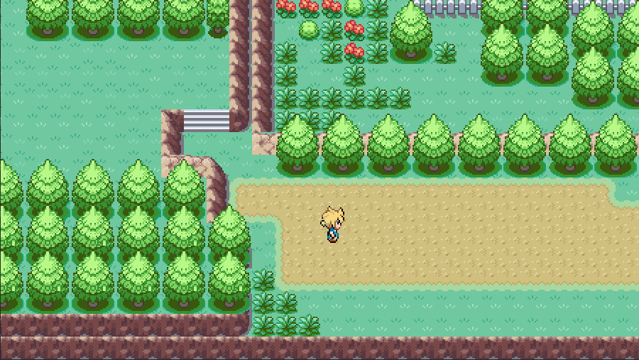
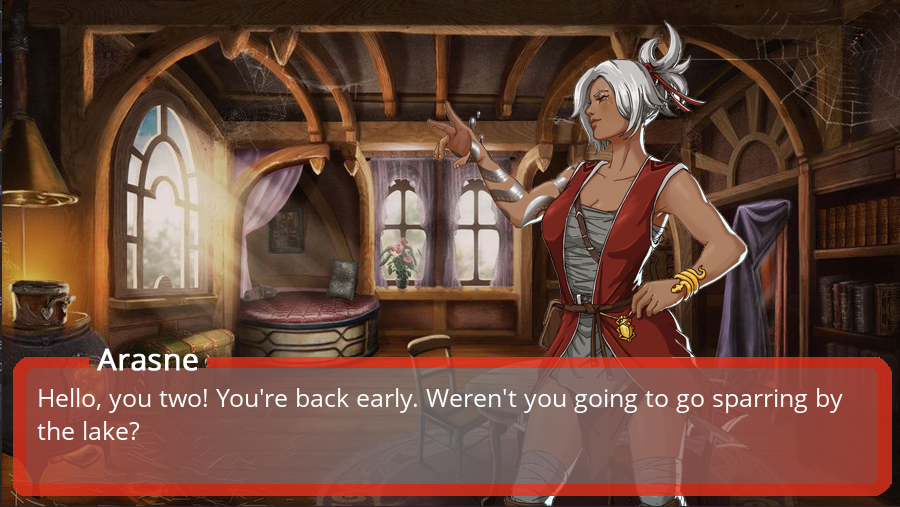
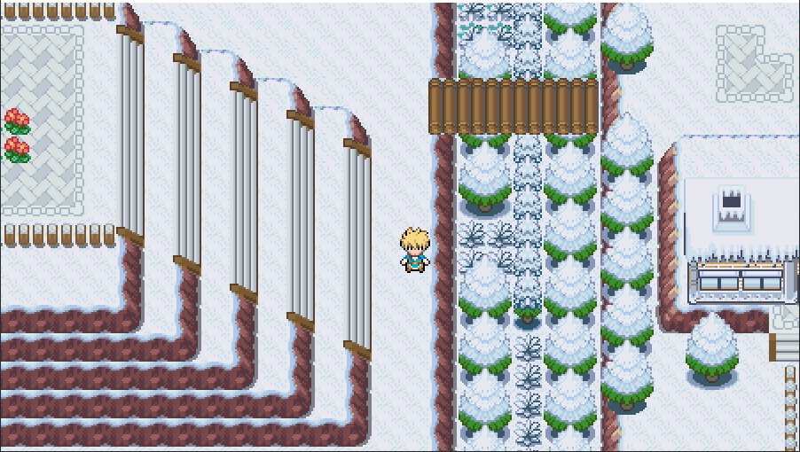
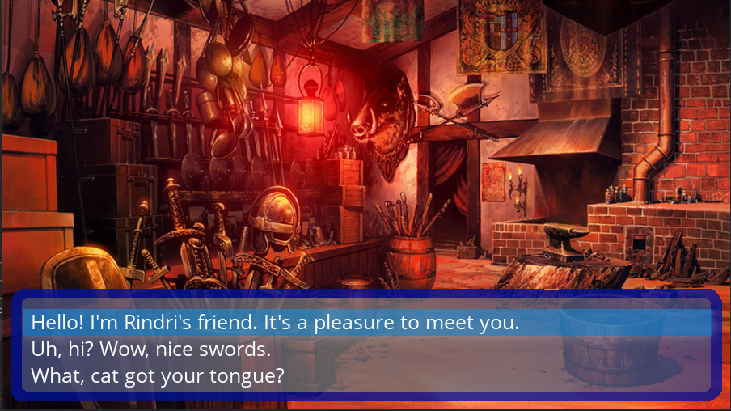
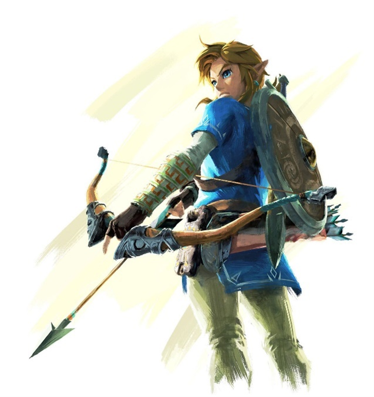

# An Unnamed PyGame Tilemap Game
Proof-of-concept for a tile-based game created in PyGame, inspired by Pokémon and visual novels. 

## Game screenshots

Well, well, what do we have here? If you guessed “an insanely good looking, complex, over-the-top 2D game that took 
weeks of non-stop work to create and was good practise but also definitely way too much work” then you’re certainly 
right!

## What is this?
I made this project as part of my final assignment for a Programming for Psychologists module at UCL. I didn't have any
game dev experience back then and barely knew how to use python, let alone pygame. This game was my first big project 
and basically a trial by fire. So beware, even though it runs and is very well commented, some elements of the game may
still show signs of sloppy beginner code.

## What is this about an 'experiment'?
The brief for the final assignment of the Python for Psychologists module was that students could create anything, as 
long as it was similar to a psychology experiment. 'Experiment' being quite loosely defined by the lecturer.

The research question in this experiment was: “What choices do players make in video games, and are these choices 
internally consistent?”. 
The experiment records the choices players make in a custom-made video game focussed around interaction and exploration.
In exploring the world, the player will interact with multiple NPCs (non-player characters) and is given the option to 
respond. Three dialog choices are always available: 
* a friendly/polite option.
* a neutral option. 
* a rude option. 

The player’s choices of these dialog options are recorded. These can later be analysed to look at differences in 
responding between NPCs, average/maximum/minimum responses type, individual differences, and order in which the player 
took part in the dialogs.

The experiment runs in two parts:
1. The demographics and information sheet. These are filled out by participants prior to starting. They are collected by
running `Demograhics.py`. 
2. Once the demographics have been filled out, the players can start the game, by running `Game.py`. The game begins 
with some exposition dialog, after which the player is relatively free to move around the tilemap and explore. Dialogs 
are triggered by entering buildings. Some buildings have to be entered at different stages in order for the game to 
progress. After the player has gone through the entirety of the story, the game will quit by itself. The minimum amount 
of dialog choices a player can make is 31. The maximum amount is 51 choices.

## How to run
The two programs run smoothly by themselves, provided all referenced files are in the right place. 
It is especially important that the img, dialog, sprites, fonts and tiles folders contain the right assets and that the 
`.tmx`, `.tsx` and `.py `files are in the main folder. The `pygame` library should be installed as well.

Run `Demographics.py` to open a PyQT5 interface with an info sheet and demographics questions.

Run `game.py` to play the game.

Adding new dialog for an existing location is easy: copy one of the existing `.xml` files, follow the structure 
presented there for entering text and player options, and save the file with the name of the location and the next 
available number. 

Adding a new location and dialog is currently harder to do (although not too hard), and requires going into the `.tmx` 
and `.py` files to add code.

All participant demographic data can be found in the `participants/participantsData.csv` file. 
All player choice information can be found in the `participants/[player name] choices, [date].csv` files. 

A new player choice file will be created for each player, provided the player doesn’t use the same name as an existing 
player on the same day. 

## Credit where credit is due
However highly (or lowly) you may think of me, I didn’t not create all the assets that are used in this program. Nor all
the code. Please find a full list of credits down here.

### Tilesets
* Tileset for the snow landscape: separate tilesets created by me from image found here: 
* https://fanart.pokefans.net/tutorials/mapping/tilesets.
* Tileset for the grass landscape: tiles are from Pokemon FireRed/LeafGreen. Separate tilesets created by me from image 
found here: https://www.deviantart.com/ozotwo/art/Pokemon-Tileset-Fire-Red-Leaf-Green-Outdoors-C-446156842 
### Sprites
* Player sprites were custom-drawn by me, using the Tower Tycoon Palmer overworld sprite from Nintendo’s Pokemon Diamond
/Pearl as a reference: https://www.spriters-resource.com/ds_dsi/pokemondiamondpearl/sheet/6934/. 
The design is based on a certainly blonde haired, sheika slate wielding, amnesic Hyrulian boy. That’s right. 
(Please don’t sue me Nintendo, I have too much to live for.)
 

[comment]: <> (![Link from Breath of the Wild]&#40;img.png?raw=true&#41;)

* Companion sprites were custom drawn by me, using the female Ace Trainer overworld sprite from Pokemon Diamond/Pearl as
a reference: https://www.spriters-resource.com/ds_dsi/pokemondiamondpearl/sheet/6931/ 
### NPC images
* All NPC images were drawn by Ernesto Irawan: https://www.artstation.com/ernestoirawan and edited appropriately by me.
* Fox: http://pixeljoint.com/p/124605.htm 
### Background images
* Dojo background: Augustinas Raginskis, https://www.artstation.com/artwork/3o19ZA 
* Snow background: Reid Southen, https://www.deviantart.com/rahll/art/Convergence-215267624 
* Armoury background: Unknown
* House background: Unknown
* Lake background: http://material.animehack.jp/bg_nature.html, free to use 
* WASD keys: Thesaurusrex,  https://www.redbubble.com/people/thesaurusrex/works/21656630-wasd-keys-black?p=t-shirt 
### Dialog boxes
All dialog boxes were made by me in Photoshop. 
### Software used
* Tiled tilemap editor for creating and editing the tilemap: https://www.mapeditor.org/. 
* Pycharm 2018.4.2 (Professional Edition) for writing/debugging code and .xml files: https://www.jetbrains.com/pycharm/ 
* Adobe Photoshop Elements 2018 for all image manipulation: https://www.adobe.com/uk/products/photoshop-elements/  
### Code
* Pygame: https://www.pygame.org/wiki/about 
* TMX: https://github.com/renfredxh/tmx (for importing the tilemap)
* PyQT: https://wiki.python.org/moin/PyQt (for the demographics GUI)
* Pyllet Town: https://github.com/renfredxh/pylletTown (reference/jumping-off-point for the Game file code)
* Text wrap: https://www.pygame.org/wiki/TextWrap 
* Input: https://stackoverflow.com/questions/14111381/how-to-get-text-input-from-user-in-pygame (jumping-off-point for 
the username input code)

I started this project on 23/01/2019 without any previous game dev knowledge and worked on it almost every day for 
multiple hours until 17/02/2019. Although it was definitely not always enjoyable (I despised the damn thing by the end of it) and it took the place of many, many other things I could and should have been doing, I have to say I’m quite proud of the result. Hopefully, you’ll agree 😊 